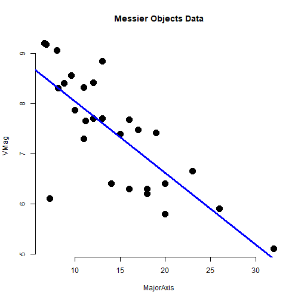

Final Assignment - Messier Object Magnitude
========================================================
author: Scott Bushman
date: 09/19/2021
autosize: true

This presentation resides: http://rpubs.com/sbklb1/FinalMessier
 - if viewed here, you may need to reduce the page zoom
 
This application resides:  https://sbklb1.shinyapps.io/MessierAssign/

This GitHub repository:  https://github.com/sbklb1/DevDataProductAssign3


Messier Magnitude - Overview
========================================================
- This application enables users to investigate the impact of 
  object size (Major Axis) on the visual magnitude for 
  astronomical objects in the Messier Catalog.

- In the application, users can select different groups of object types (galaxy, 
  cluster, etc), and the plot will automatically update.
    
- At least one object grouping is required or an error is generated.

- Each point is labeled with the Messier Catalog ID.  For Example, 
M31 (Andromeda Galaxy), is labeled 31 in the chart when the Galaxy 
group is selected.  It is a very large object (MajorAxis is > 3 degrees), 
and relatively bright (VMag 4)

- Data is brushable and provides a linear fit for the selected 
  data. If the group is changed, rebrush to update the fit.


Example Grouping
========================================================

- Application shows how Messier Object magnitude relates to size.  
The original dataset provides these object types:
            N = Nebula
            SNR = SuperNova Remnant
            PN = Planetary Nebula
            RN = reflection Nebula
            Gx = Galaxy
            GC = Glob Cluster
            OC = Open Cluster
            CL = star cloud

- For simplification, this subset of the data classifies multiple types 
(planetary, reflection, SuperNova Remant, and Nebula) under the single 
classification "Nebula"

- Also group star clouds and other unusual items under a single "other" category


- Try the following example in the application.  Open the application and select the Globular 
Cluster group.  It is a mostly linear plot with size.  It is approximated on the next slide 
using static R plot objects

- VMag gets "smaller" as the object gets brighter.  For example the full Moon is -13 Mag, 
Jupiter is about -4 Mag, many stars are -1 to 3 mag, and the normal naked eye visible objects 
are less than 6.

- In this example, as a Globular cluster gets larger (say M22 or M13), it appears brighter than
  a smaller cluster (say M79).
  


Approximate Plot for Globular Clusters
========================================================
- Given is a static plot, without labels, of what is generated in the shiny application,
here for just Globular Cluster data.
- A linear fit is given for all the data, not a brushed dataset



```
MajorAxis 
-0.142704 
```

```
(Intercept) 
   9.464216 
```


Data Source and Preprocess
========================================================
- The original dataset for this project is the Stellerium Nebulae Catalog:  
- https://github.com/Stellarium/stellarium/blob/master/nebulae/default/catalog.txt
  
- Data was preprocessed to reduce the original 95,000 rows to a managable subset:
  - Extract only the Messier objects
  - Remove less interesting data like redshift error
  - Remove various columns related to other catalog cross-reference data
  - Copy and paste data in Excel as needed to create initial subset
  
